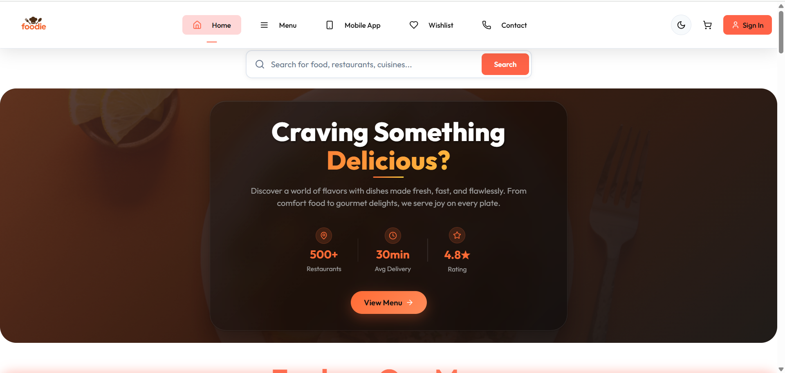

# 🍽️ Foodie – Full-Stack Restaurant App

A full-stack web application for browsing, ordering, and managing food items. Built with **React**, **Express.js**, **MongoDB**, and **Firebase Authentication**, featuring complete **Docker** support for seamless development and deployment.

  
<sup>Homepage – Light Mode</sup>

---

## 📑 Table of Contents

- [🔧 Tech Stack](#-tech-stack)
- [✨ Key Features](#-key-features)
- [🚀 Quick Start](#-quick-start)
- [📦 Installation](#-installation)
- [⚙️ Environment Setup](#-environment-setup)
- [🔥 Firebase Setup](#-firebase-setup)
- [🐳 Docker Setup](#-docker-setup)
- [📁 Project Structure](#-project-structure)
- [🧪 Development](#-development)
- [🤝 Contributing](#-contributing)
- [📄 License](#-license)

---

## 🔧 Tech Stack

### 🖥️ Frontend

- **React 18.3** with **Vite**
- **React Router DOM** – Routing
- **Firebase Authentication** – Google, Facebook, Twitter
- **React Hot Toast** – Notifications
- **Lucide React** – Icons
- **GSAP** – Animations

### 🌐 Backend

- **Node.js + Express.js** – REST API server
- **MongoDB** with **Mongoose**
- **Firebase Admin SDK**
- **Razorpay** – Payment gateway
- **Multer** – File upload handling
- **Modular API Routing**

### 🗄️ Database

- **MongoDB** – Primary database
- **Firebase Firestore** – User profiles

### 🐳 DevOps

- **Docker & Docker Compose**
- **Multi-stage builds**
- **Environment-based configuration**

---

## ✨ Key Features

- 🔐 Multi-provider Authentication (Google, Facebook, Twitter, Email)
- 🥗 Browse and explore food items
- 🛒 Shopping cart and checkout
- 💳 Secure payments with Razorpay
- 👤 User profiles and order history
- 🎨 Responsive design
- 🏪 Admin panel for food management
- 📱 Mobile-friendly interface

---

## 🚀 Quick Start

### Prerequisites

- **Docker Desktop** (recommended)
- **Node.js 16+** (for manual setup)
- **MongoDB**
- **Firebase Project**

### One-Command Setup (Docker)

```bash
git clone https://github.com/Stranger1298/Foodie.git
cd Foodie
cp backend/.env.example backend/.env
cp frontend/.env.example frontend/.env
cp admin/.env.example admin/.env
# Edit .env files with your configurations
docker-compose up --build
```

**Access Points:**

- 🌐 **Frontend**: http://localhost:3000  
- 🛠️ **Admin Panel**: http://localhost:5173  
- 🔌 **Backend API**: http://localhost:4000

---

## 📦 Installation

```bash
git clone https://github.com/Stranger1298/Foodie.git
cd Foodie
```

### Install Dependencies

```bash
# Backend
cd backend
npm install

# Frontend
cd ../frontend
npm install

# Admin
cd ../admin
npm install
```

---

## ⚙️ Environment Setup

```bash
cp backend/.env.example backend/.env
cp frontend/.env.example frontend/.env
cp admin/.env.example admin/.env
```

Edit each `.env` file with the appropriate credentials and API keys as described in their comments.

---

## 🔥 Firebase Setup

1. Go to [Firebase Console](https://console.firebase.google.com/)  
2. Create a project  
3. Enable **Google**, **Facebook**, **Twitter** authentication  
4. Add authorized domains (`localhost`, `127.0.0.1`)  
5. Create a **Web App** in Firebase  
6. Generate and download a **Service Account Key**  
7. Use values in `backend/.env` and `frontend/.env`  
8. Set up **Firestore** with the following rules:

```javascript
rules_version = '2';
service cloud.firestore {
  match /databases/{database}/documents {
    match /users/{userId} {
      allow read, write: if request.auth != null && request.auth.uid == userId;
    }
  }
}
```

---

## 🐳 Docker Setup

### Production Setup

```bash
docker-compose up --build
# or run in background
docker-compose up -d
# stop services
docker-compose down
```

### Development

```bash
docker-compose logs -f backend
docker-compose exec backend npm install some-package
docker-compose restart frontend
```

---

## 📁 Project Structure

```
Foodie/
├── frontend/
│   └── src/
│       ├── components/
│       ├── config/
│       ├── context/
│       ├── hooks/
│       └── pages/
├── backend/
│   ├── config/
│   ├── controllers/
│   ├── models/
│   ├── routes/
│   └── uploads/
├── admin/
├── docker-compose.yml
└── README.md
```

---

## 🧪 Development

```bash
# Start backend
cd backend
npm run server

# Start frontend
cd ../frontend
npm run dev

# Start admin panel
cd ../admin
npm run dev
```

### Available Scripts

| Service  | Command           | Description                |
|----------|-------------------|----------------------------|
| Backend  | `npm run server`  | Start dev server (nodemon) |
| Backend  | `npm start`       | Start prod server          |
| Frontend | `npm run dev`     | Start Vite dev server      |
| Frontend | `npm run build`   | Build frontend             |
| Admin    | `npm run dev`     | Start Vite dev server      |
| Admin    | `npm run build`   | Build admin panel          |

---

## 🤝 Contributing

We welcome contributions!

1. ⭐ Star this repo  
2. 🐛 Report issues  
3. 💡 Suggest features  
4. 🔧 Submit PRs

**Workflow:**

```bash
git checkout -b feature/my-feature
docker-compose up --build
git commit -m "Add my feature"
git push origin feature/my-feature
```

---

## 📄 License

Licensed under the **MIT License** – see [LICENSE](LICENSE)

---

## 🙏 Acknowledgements

- [React](https://reactjs.org/)
- [Express](https://expressjs.com/)
- [MongoDB](https://www.mongodb.com/)
- [Firebase](https://firebase.google.com/)
- [Vite](https://vitejs.dev/)
- [Docker](https://www.docker.com/)
- [Razorpay](https://razorpay.com/)

---

**⚡ Quick Links:**

- 📚 [Firebase Setup Guide](FIREBASE_SETUP.md)  
- 🤝 [Contributing Guidelines](CONTRIBUTING.md)  
- 🛡️ [Security Policy](SECURITY.md)  
- 📝 [Code of Conduct](CODE_OF_CONDUCT.md)

---

<div align="center">
  <h3>Built with ❤️ by the Foodie Team</h3>
  <p>⭐ Star this repo if you found it helpful!</p>
</div>